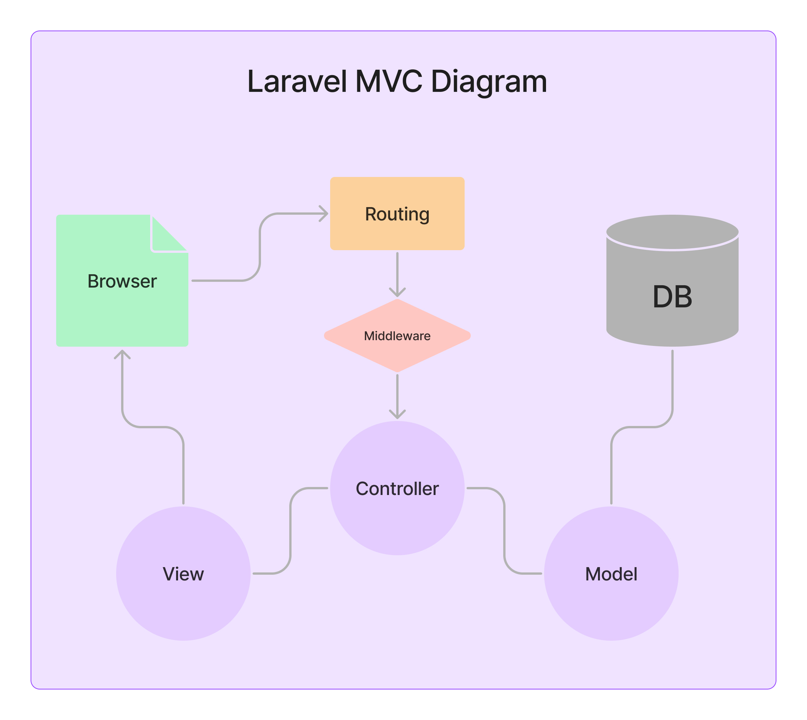

.env, # Proyecto de Gestión de Productos con Laravel



Este proyecto utiliza el framework Laravel para crear una aplicación de gestión de productos. La elección de Laravel se basa en su eficiencia y herramientas.

## Dump SQL

El archivo di-rosa_mauro.sql se encuentra en la carpeta 'resources' de este repositorio.

## Características

- Se emplean migraciones de Artisan para crear las tablas de la base de datos.
- Se utiliza Artisan para generar modelos y controladores.
- Modelos y controladores existentes se adaptan para registro, inicio de sesión y cierre de sesión de usuarios.
- Las contraseñas se almacenan de manera segura con bcrypt.
- Reglas de validación de Illuminate se usan para asegurar datos válidos.
- Usuarios registrados pueden realizar operaciones CR en productos.
- Usuarios con permiso de administrador pueden realizar todas las operaciones en productos.
- Se creo una migracion para agregar la columna 'isadmin' en la tabla users sin perder los datos ya guardados en la misma.
- Se implemento autenticación en rutas clave usando el middleware "auth" y dentro de este se creo un gate para manejar permisos de administrador en la navegacion.
- La conexión a la base de datos se configura en `.env` con PDO.
- Se creo el componente de blade para usar de cabecera html y nav-bar global de la aplicacion.

## Configuración

1. Configura Laravel en tu entorno.
2. Clona este repositorio.
3. Ajusta `.env` con los detalles de tu base de datos: se debe copiar el archivo del ejemplo .env.example, renombrarlo como .env y luego reemplazar los siguientes datos de conexion en la seccion mysql: 

```
DB_CONNECTION=mysql
DB_HOST=127.0.0.1
DB_PORT=3306
DB_DATABASE=mvc-crud
DB_USERNAME=root
DB_PASSWORD=
```

4. Crear base de datos llamada mvc-crud y conectar con los parametros del punto anterior (por ejemplo utilizando XAMPP).
5. Ejecuta `php artisan migrate` para crear tablas.

## Deployment del projecto Laravel en 000webhost

Para subir la aplicación se comprimío todo el proyecto y se subió al servidor junto con los archivos en el repositorio de unzipper: https://github.com/ndeet/unzipper

Luego se visito el sitio “nuestro-sitio”/unzipper.php y se descomprimió el archivo del proyecto.

Se necesito cambiar la version de php del host y seguir pasos de los siguientes links:

https://kodementor.com/how-to-deploy-laravel-project-in-000webhost/#:~:text=First%20of%20all%2C%20we%20need%20to%20upload%20our%20laravel%20application,makes%20it%20fast%20and%20easy.

https://www.000webhost.com/forum/t/ftp-put-cant-open-that-file-no-such-file-or-directory/77199

Se deberian llevar a cabo mas configuraciones como por ejemplo no mostrar los errores, etc,. antes de utilizar un proyecto asi para uso comercial.